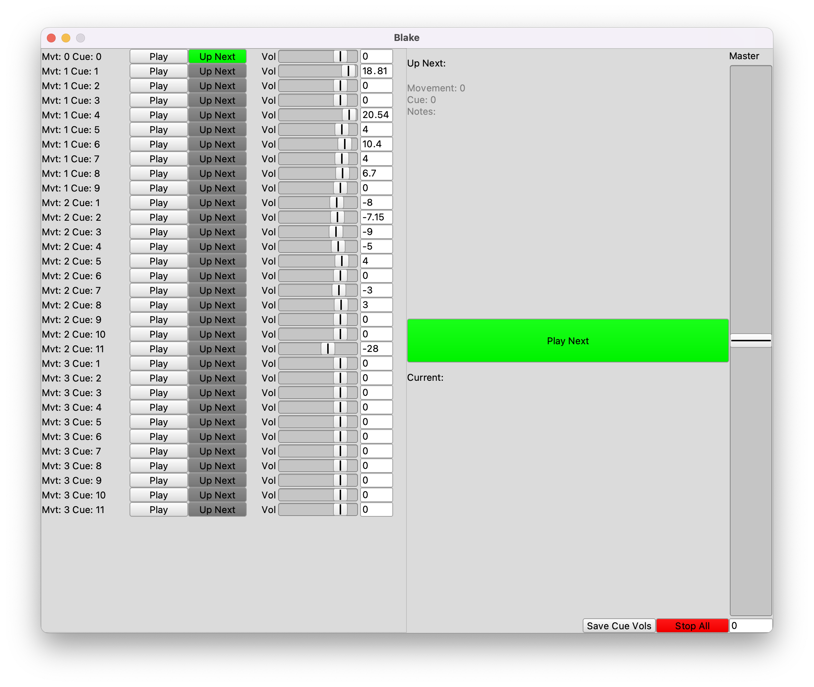

# File-to-Speaker Player

SuperCollider program for playing audio files to specific speaker outputs

Created specifically for playing sound files in [The Cube at Virginia Tech](https://icat.vt.edu/studios/the-cube.html) for [Tiffany Skidmore](https://www.tiffanymskidmore.com/)'s [_The William Blake Cycle_](https://www.tiffanymskidmore.com/browse/the-william-blake-cycle) performance December 2022.

## How it works

In one folder needs to be: 

* the `cue-player.scd` script
* a tab-separated values file called `data.tsv` (described below)
* all the audio files referenced in the `data.tsv` (these can be organized in sub-folders however you like, the script searches recursively, however, each file must be uniquely named, for example, if two files in different folders are both called "file-01.wav", this will not work!)

### The `data.tsv` File

We created a spreadsheet in Google Drive for keeping track of all the files used in the performance. Each row is one audio file that will be used. The columns of this spreadsheet (the first row is these headers!) are:

* **"movement":** this performance was a multi-movement work, so this indicates which movement this file is a part of
* **"cue":** which cue in the movement this file is a part of
* **"file":** the name of the audio file
* **"loudness":** a loudness adjustment in dB, so 0 means no change. +/- values will increase or decrease the volume of this specific sound file
* **"speakers":** which speaker(s) (hardware outputs, as an integer, with 1 being the lowest number) this file should go to. if it should go to more than one speaker, the speaker integers should be separated by a comma
* **"notes":** any notes that show up in the software display, such as "this is the one for when the sax player gets up on the platform"

The Google sheet needs to be downloaded as a `tsv` file so that the software can find it and load it. (It needs to be a `tsv` instead of a `csv` because the "speakers" are separated by commas.)

Once loaded, the GUI is pretty self explanatory. Hitting spacebar will advance cues. The master fader is hardcoded to be MIDI CC 7, but this could easily be changed in the code.

### Per Cue Volume Control

In the GUI each cue has an independent volume control (in dB). Note that this value does not exist in the spreadsheet because the spreadsheet contains specific information for each individual _file_. A cue can have more than one file, so the per cue volume control is stored separate from the spreadsheet (as a SuperCollier `Object.writeArchive` file called `cue-vols.scarchive`). The cue volumes set in the GUI can be saved by pressing the "Save Cue Vols" button. They save as a nested `Dictionary` using the movement number and cue number as keys. When the script is run, the software loads `cue-vols.scarchive` automatically. If any cues are not found in the file, they default to 0 dB.

## Dependencies

* Ted Moore's [SelectFiles](https://github.com/tedmoore/SelectFiles) extension for SuperCollider